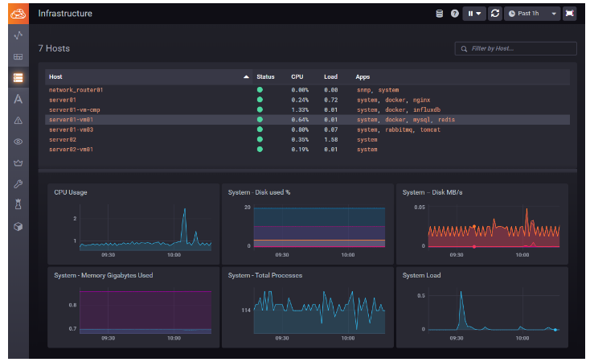

# JG_Portfolio
이 개발 포트폴리오는 지금까지 수행한 프로젝트에서 경험한 다양한 문제와 그 해결 방법을 정리한 문서입니다. 

각 프로젝트에서 직면한 도전과 해결 과정, 그리고 얻은 교훈을 기록하여 저의 성장과 기술력을 한눈에 볼 수 있도록 구성하였습니다.

또한, 향후 비슷한 상황이 발생했을 때 신속하고 효율적으로 대처할 수 있도록 하는 것을 목표로 하고 있습니다.

    

# 온라인/오프라인 강의 수강 이력
## 온라인 강의
- **HTTP 강의**  
  강사: 김영한  
  [수료증](https://github.com/jaegeunha94/JG_Portfolio/blob/main/Course/%E1%84%80%E1%85%B5%E1%86%B7%E1%84%8B%E1%85%A7%E1%86%BC%E1%84%92%E1%85%A1%E1%86%AB_HTTP.pdf)  
  [강의 링크](https://www.inflearn.com/course/http-%EC%9B%B9-%EB%84%A4%ED%8A%B8%EC%9B%8C%ED%81%AC)

- **Next.js 강의**  
  강사: 이정환  
  [수료증](https://github.com/jaegeunha94/JG_Portfolio/blob/main/Course/%EC%9D%B4%EC%A0%95%ED%99%98_NextJS.pdf)  
  [강의 링크](https://www.inflearn.com/course/%ED%95%9C%EC%9E%85-%ED%81%AC%EA%B8%B0-nextjs?attributionToken=jAHwiwoMCKjQ37sGEJHUirgCEAEaJDY3YTJjZjNmLTAwMDAtMjYzYS05M2I1LTg4M2QyNGY2ZWI4OCoGNTg3NzEyMjCjgJciwvCeFdSynRWOvp0VtreMLajlqi3Fy_MXkPeyMJruxjCOkckwn9a3LZzWty06DmRlZmF1bHRfc2VhcmNoQAFIAVgBaAF6AnNp)

- **RAG (Retrieval-Augmented Generation) 강의**  
  강사: 테디노트  
  [수료증](https://github.com/jaegeunha94/JG_Portfolio/blob/main/Course/%ED%85%8C%EB%94%94%EB%85%B8%ED%8A%B8_RAG.pdf)  
  [강의 링크](https://fastcampus.co.kr/data_online_teddy)

- **React 강의**  
  강사: Zerocho  
  [수료증](https://github.com/jaegeunha94/JG_Portfolio/blob/main/Course/Zerocho_React.pdf)  
  [강의 링크](https://www.inflearn.com/course/%ED%81%B4%EB%A1%A0%EC%BD%94%EB%94%A9-%EC%8B%A4%EC%8B%9C%EA%B0%84%EC%B1%84%ED%8C%85)

- **TypeScript 강의**  
  강사: Zerocho  
  [수료증](https://github.com/jaegeunha94/JG_Portfolio/blob/main/Course/Zerocho_Typescript_1.pdf)  
  [강의 링크 1](https://www.inflearn.com/course/%ED%83%80%EC%9E%85%EC%8A%A4%ED%81%AC%EB%A6%BD%ED%8A%B8-%EC%98%AC%EC%9D%B8%EC%9B%90-1)  
  [수료증 2](https://github.com/jaegeunha94/JG_Portfolio/blob/main/Course/Zerocho_Typescript_2.pdf)  
  [강의 링크 2](https://www.inflearn.com/course/%ED%83%80%EC%9E%85%EC%8A%A4%ED%81%AC%EB%A6%BD%ED%8A%B8-%EC%98%AC%EC%9D%B8%EC%9B%90-2)

- **Webpack 강의**  
  강사: 장기효  
  [수료증](https://github.com/jaegeunha94/JG_Portfolio/blob/main/Course/%E1%84%8C%E1%85%A1%E1%86%BC%E1%84%80%E1%85%B5%E1%84%92%E1%85%AD_Webpack.pdf)  
  [강의 링크](https://www.inflearn.com/course/%ED%94%84%EB%9F%B0%ED%8A%B8%EC%97%94%EB%93%9C-%EC%9B%B9%ED%8C%A9)

## 오프라인 강의
- **Prompt Engineering 강의**  
  강사: 강수진
  [수료증](https://github.com/jaegeunha94/JG_Portfolio/blob/main/Course/%EA%B0%95%EC%88%98%EC%A7%84_%ED%94%84%EB%A1%AC%ED%94%84%ED%8A%B8%EC%97%94%EC%A7%80%EB%8B%88%EC%96%B4%EB%A7%81.pdf)

    

# Project
## [CloudHub](https://github.com/jaegeunha94/JG_Portfolio/tree/main/Project/CloudHub)

    

# Database
## [InfluxDB](https://github.com/jaegeunha94/JG_Portfolio/tree/main/Database/InfluxDB)
* [Curl](https://github.com/jaegeunha94/JG_Portfolio/tree/main/Database/InfluxDB/Curl)
* [Query](https://github.com/jaegeunha94/JG_Portfolio/tree/main/Database/InfluxDB/Query)
* [Managing User](https://github.com/jaegeunha94/JG_Portfolio/tree/main/Database/InfluxDB/User/ManagingUser.md)

### InfluxDB TroubleShoot
* [Retention Policy](https://github.com/jaegeunha94/JG_Portfolio/tree/main/Database/InfluxDB/TroubleShoot/RetentionPolicy.md)
* [Regex Query Fix](https://github.com/jaegeunha94/JG_Portfolio/tree/main/Database/InfluxDB/TroubleShoot/Regex_query_fix.md)
* [Tag Values Not Expiring](https://github.com/jaegeunha94/JG_Portfolio/tree/main/Database/InfluxDB/TroubleShoot/TagValuesNotExpiring.md)
* [Timezone Aggregation Misconception](https://github.com/jaegeunha94/JG_Portfolio/blob/main/Database/InfluxDB/TroubleShoot/Timezone_Aggregation_Misconception.md)

## MariaDB
### MariaDB TroubleShoot
* [Too Many Connections](https://github.com/jaegeunha94/JG_Portfolio/tree/main/Database/MariaDB/TroubleShoot/TooManyConnections.md)

## Oracle
### Oracle TroubleShoot
* [Check Instance Name](https://github.com/jaegeunha94/JG_Portfolio/tree/main/Database/Oracle/TroubleShoot/CheckInstanceName.md)
* [Listener supports no services](https://github.com/jaegeunha94/JG_Portfolio/tree/main/Database/Oracle/TroubleShoot/Listener_supports_no_services.md)

# Docker
## Docker TroubleShoot
* [Build Env](https://github.com/jaegeunha94/JG_Portfolio/tree/main/Docker/TroubleShoot/BuildEnv.md)
* [Check Docker Image CPU Architecture](https://github.com/jaegeunha94/JG_Portfolio/tree/main/Docker/TroubleShoot/CheckImageCPUArchitecture.md)
* [Container Memory Limit](https://github.com/jaegeunha94/JG_Portfolio/tree/main/Docker/TroubleShoot/ContainerMemoryLimit.md)
* [Dangling Image](https://github.com/jaegeunha94/JG_Portfolio/tree/main/Docker/TroubleShoot/Dangling_Image.md)
* [IP Tables Failed Error](https://github.com/jaegeunha94/JG_Portfolio/tree/main/Docker/TroubleShoot/iptables_failed.md)

## Docker-Compose
* [Docker-Compose Version 1 Install](https://github.com/jaegeunha94/JG_Portfolio/tree/main/Docker/Docker-Compose/v1_Install)
* [Docker Compose Version 2](https://github.com/jaegeunha94/JG_Portfolio/blob/main/Docker/Docker-Compose/v2/README.md)

### Docker-Compose TroubleShoot
* [Docker-compose Permission](https://github.com/jaegeunha94/JG_Portfolio/blob/main/Docker/Docker-Compose/TroubleShoot/docker-compose_Permission.md)

# Frontend
* [Engyme](https://github.com/jaegeunha94/JG_Portfolio/tree/main/Frontend/Test/Jest/Engyme)
* [Jest](https://github.com/jaegeunha94/JG_Portfolio/tree/main/Frontend/Test/Jest)
* [Prettier](https://github.com/jaegeunha94/JG_Portfolio/tree/main/Frontend/Code_Formatter/Prettier)
* [NPM Audit](https://github.com/jaegeunha94/JG_Portfolio/blob/main/Frontend/PackageManager/NPM/Audit.md)

## CSS
### CSS TroubleShoot
* [Opacity Error In React](https://github.com/jaegeunha94/JG_Portfolio/blob/main/Frontend/CSS/TroubleShoot/OpacityErrorInReact.md)

## NodeJS
* [Conda Environment](https://github.com/jaegeunha94/JG_Portfolio/blob/main/Frontend/NodeJS/CondaEnvironment)

### NodeJS TroubleShoot
* [could not find a version of VisualStudio2017](https://github.com/jaegeunha94/JG_Portfolio/blob/main/Frontend/NodeJS/TroubleShoot/couldnotfindaversionofVisualStudio2017.md)
* [not defined npm config node gyp](https://github.com/jaegeunha94/JG_Portfolio/blob/main/Frontend/NodeJS/TroubleShoot/not_defined_npm_config_node_gyp.md)

# Git
## Git TroubleShoot
* [CRLF, LF Issue](https://github.com/jaegeunha94/JG_Portfolio/blob/main/Git/TroubleShoot/CRLF_LF.md)
* [Tag Synchronization Issue](https://github.com/jaegeunha94/JG_Portfolio/blob/main/Git/TroubleShoot/Tag_Synchronization_Issue.md)

# Kubernetes
## Kubernetes TroubleShoot
* [Delete Pod Restart Always](https://github.com/jaegeunha94/JG_Portfolio/tree/main/Kubernetes/TroubleShoot/Delete_Pod_Restart_Always.md)
* [Join Error](https://github.com/jaegeunha94/JG_Portfolio/tree/main/Kubernetes/TroubleShoot/JoinError.md)
* [Reset](https://github.com/jaegeunha94/JG_Portfolio/tree/main/Kubernetes/TroubleShoot/Reset.md)
* [TLS Error](https://github.com/jaegeunha94/JG_Portfolio/tree/main/Kubernetes/TroubleShoot/TLS_Error.md)

# Library
## Javascript
### axios
* [Interceptor](https://github.com/jaegeunha94/JG_Portfolio/tree/main/Library/Javascript/axios/interceptor.md)

### Chart JS
* [ChartJS](https://github.com/jaegeunha94/JG_Portfolio/tree/main/Library/Javascript/ChartJS)

#### ChartJS TroubleShoot
* [Show Zero Value In Bar Graph](https://github.com/jaegeunha94/JG_Portfolio/tree/main/Library/Javascript/ChartJS/TroubleShoot/ShowZeroValueInBarGraph.md)

### Cron Parser
* [Cron Parser](https://github.com/jaegeunha94/JG_Portfolio/tree/main/Library/Javascript/cron-parser)

### D3
* [scaleSequential 함수](https://github.com/jaegeunha94/JG_Portfolio/tree/main/Library/Javascript/D3/scaleSequential)

### day.js
* [day.js](https://github.com/jaegeunha94/JG_Portfolio/tree/main/Library/Javascript/day.js)

### papaparse
* [papaparse](https://github.com/jaegeunha94/JG_Portfolio/tree/main/Library/Javascript/papaparse)

### mxGraph
#### mxGraph TroubleShoot
* [Outline_LabelsVisible](https://github.com/jaegeunha94/JG_Portfolio/blob/main/Library/Javascript/mxGraph/TroubleShoot/Outline_LabelsVisible.md)

## React
* [React Chart Library](https://github.com/jaegeunha94/JG_Portfolio/tree/main/Library/React/React_Chart)

# Network
## RFC
* [RFC](https://github.com/jaegeunha94/JG_Portfolio/tree/main/Network/RFC/README.md)
* [RFC 3339](https://github.com/jaegeunha94/JG_Portfolio/tree/main/Network/RFC/RFC3339.md)

## SNMP
* [SNMP Version Authentication](https://github.com/jaegeunha94/JG_Portfolio/tree/main/Network/SNMP/SNMP_Version_Authentication.md)

# OpenSource
## ETCD
* [Clustering](https://github.com/jaegeunha94/JG_Portfolio/tree/main/OpenSource/ETCD/Clustering)

### ETCD TroubleShoot
* [Auto Compaction Retention](https://github.com/jaegeunha94/JG_Portfolio/tree/main/OpenSource/ETCD/TroubleShoot/Auto_Compaction_Retention.md)
* [ClusterID Mistmatch](https://github.com/jaegeunha94/JG_Portfolio/tree/main/OpenSource/ETCD/TroubleShoot/ClusterID_Mistmatch.md)

## [Kapacitor](https://github.com/jaegeunha94/JG_Portfolio/tree/main/OpenSource/Kapacitor) 
* [Tickscript_Batch_Sum](https://github.com/jaegeunha94/JG_Portfolio/tree/main/OpenSource/Kapacitor/Tickscript_Batch_Sum)
* [Tickscript Stream/Batch](https://github.com/jaegeunha94/JG_Portfolio/tree/main/OpenSource/Kapacitor/Tickscript_Stream_Batch)
* [Tickscript Stream Subquery](https://github.com/jaegeunha94/JG_Portfolio/tree/main/OpenSource/Kapacitor/Tickscript_Stream_Batch/StreamSubquery.md)
* [Tickscript Syntax](https://github.com/jaegeunha94/JG_Portfolio/tree/main/OpenSource/Kapacitor/Tickscript_Syntax)

## Kibana
* [Bar Chart](https://github.com/jaegeunha94/JG_Portfolio/tree/main/OpenSource/Kibana/VisualizationType/BarChart.md)

## [SaltStack](https://github.com/jaegeunha94/JG_Portfolio/tree/main/OpenSource/SaltStack)
* Cloud
    * [AWS](https://github.com/jaegeunha94/JG_Portfolio/tree/main/OpenSource/SaltStack/Cloud/AWS.md)
    * [GCP](https://github.com/jaegeunha94/JG_Portfolio/tree/main/OpenSource/SaltStack/Cloud/GCP.md)
    * [Openstack](https://github.com/jaegeunha94/JG_Portfolio/tree/main/OpenSource/SaltStack/Cloud/Openstack.md)
* [Multi Master](https://github.com/jaegeunha94/JG_Portfolio/tree/main/OpenSource/SaltStack/MultiMaster)
* [Token](https://github.com/jaegeunha94/JG_Portfolio/tree/main/OpenSource/SaltStack/Token)

## [Telegraf](https://github.com/jaegeunha94/JG_Portfolio/tree/main/OpenSource/Telegraf)
* Cloud
    * [AWS CloudWatch](https://github.com/jaegeunha94/JG_Portfolio/tree/main/OpenSource/Telegraf/Cloud/AWS_CloudWatch.md)
    * [GCP Stackdriver](https://github.com/jaegeunha94/JG_Portfolio/tree/main/OpenSource/Telegraf/Cloud/GCP_Stackdriver.md)
* Configuration
    * [TagPass](https://github.com/jaegeunha94/JG_Portfolio/tree/main/OpenSource/Telegraf/Configuration/TagPass.md)
* [Debug Environment for Telegraf](https://github.com/jaegeunha94/JG_Portfolio/tree/main/OpenSource/Telegraf/DebugEnvironmentforTelegraf)
* [GPU Monitoring](https://github.com/jaegeunha94/JG_Portfolio/tree/main/OpenSource/Telegraf/GPU_Monitoring)
* [IPMI](https://github.com/jaegeunha94/JG_Portfolio/tree/main/OpenSource/Telegraf/IPMI)

# Programming Language
## Go
* [Miniconda](https://github.com/jaegeunha94/JG_Portfolio/tree/main/ProgrammingLanguage/Go/Miniconda)

## HTML
* [Canvas](https://github.com/jaegeunha94/JG_Portfolio/tree/main/ProgrammingLanguage/HTML/Canvas/README.md)

## Python
### Python TroubleShoot
* [Version 2.x](https://github.com/jaegeunha94/JG_Portfolio/tree/main/ProgrammingLanguage/Python/TroubleShoot/Version_2.x.md)

# Security
## PKI
* [PKI](https://github.com/jaegeunha94/JG_Portfolio/tree/main/Security/PKI)
* [Digital Envelope](https://github.com/jaegeunha94/JG_Portfolio/tree/main/Security/PKI/Digital_Envelope)
* [Digital Signature](https://github.com/jaegeunha94/JG_Portfolio/tree/main/Security/PKI/Digital_Signature)

# Server
## KeepAlived
* [KeepAlived](https://github.com/jaegeunha94/JG_Portfolio/tree/main/Server/KeepAlived)

### KeepAlived TroubleShoot
* [Receive Advertisement Timeout](https://github.com/jaegeunha94/JG_Portfolio/blob/main/Server/KeepAlived/TroubleShoot/ReceiveAdvertisementTimeout.md)

## Nginx
* [Nginx](https://github.com/jaegeunha94/JG_Portfolio/tree/main/Server/Nginx)
* [site-available_site-enabled](https://github.com/jaegeunha94/JG_Portfolio/blob/main/Server/Nginx/site-available_site-enabled.md)
* [Rewrite Log](https://github.com/jaegeunha94/JG_Portfolio/blob/main/Server/Nginx/Log/Rewrite_Log.md)
* [Nginx Configuration](https://github.com/jaegeunha94/JG_Portfolio/tree/main/Server/Nginx/Configuration)

### Nginx TroubleShoot
* [Client Max Body Size](https://github.com/jaegeunha94/JG_Portfolio/tree/main/Server/Nginx/TroubleShoot/ClientMaxBodySize.md)
* [Location Querystring Redirection](https://github.com/jaegeunha94/JG_Portfolio/tree/main/Server/Nginx/TroubleShoot/Location_Querystring_Redirection.md)
* [Port Binding Error](https://github.com/jaegeunha94/JG_Portfolio/tree/main/Server/Nginx/TroubleShoot/PortBindingError.md)
* [Proxy Buffering Off](https://github.com/jaegeunha94/JG_Portfolio/tree/main/Server/Nginx/TroubleShoot/proxy_buffering_off.md)

# Virtual
## Oracle VM VirtualBox
### Oracle VM VirtualBox TroubleShoot
* [Host-Only Network Adapter Error](https://github.com/jaegeunha94/JG_Portfolio/tree/main/Virtual/OracleVMVirtualBox/TroubleShoot/Host-OnlyNetworkAdapterError.md)
