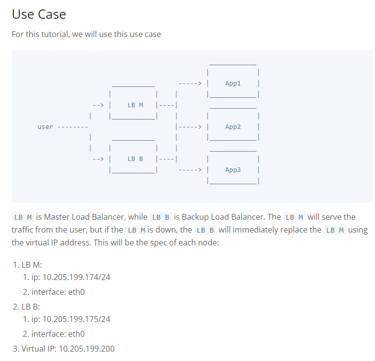

# KeepAlive 설치 절차
Ubuntu에서 설치한다고 가정한다.

# Use Case


## 1. Install Nginx
`apt install nginx`

## Install Keepalived
`apt install keepalived`

## Keepalived configuration
`touch /etc/keepalived/keepalived.conf`

## Master Load Balancer Configuration
Edit the keepalived configuration file on the LB M server.

`nano /etc/keepalived/keepalived.conf`

```
vrrp_script check_nginx {
    script "killall -0 nginx"
    interval 2
}

vrrp_instance VI_1 {
    interface eth0
    state MASTER
    priority 200

    virtual_router_id 33
    virtual_ipaddress {
        10.205.199.200
    }

    authentication {
        auth_type PASS
        auth_pass password
    }

    track_script {
        check_nginx
    }

}
```

* killall 명령이 없을 경우 `script "systemctl is-active --quiet nginx"`


## Edit the password to your own password.  
This password is used for other keepalived to join the vrrp group.

The check_nginx script will enable keepalived to check the Nginx every 2 seconds,  
if the Nginx is unavailable, keepalived will send a message to the Backup Load Balancer.

After that, start the keepalived service

`service keepalived start`

## Backup Load Balancer Configuration
Edit the keepalived configuration file on the LB B server.

`nano /etc/keepalived/keepalived.conf`

```
vrrp_script check_nginx {
    script "killall -0 nginx"
    interval 2
}

vrrp_instance VI_1 {
    interface eth0
    state BACKUP
    priority 100

    virtual_router_id 33
    virtual_ipaddress {
        10.205.199.200
    }

    authentication {
        auth_type PASS
        auth_pass password
    }

    track_script {
        check_nginx
    }

}
```

Edit the password to your own password.  
This password is used for other keepalived to join the vrrp group.  
The master & backup load balancer must have the same password.

Same with the Master, the backup also uses script  
check_nginx to always check the Nginx every 2 seconds.

After that, start the keepalived service

`service keepalived start`

## Checking The Virtual IP
To check the keepalived is working, you can check the IP address  
of each load balancer using the ip addr command.  
There will be an additional IP (The virtual IP) on the interface on the active Load Balancer.

**ip addr on LB M:**
```
root@loadbalancer-1:/etc/keepalived# ip addr
1: lo: <LOOPBACK,UP,LOWER_UP> mtu 65536 qdisc noqueue state UNKNOWN group default qlen 1000
    link/loopback 00:00:00:00:00:00 brd 00:00:00:00:00:00
    inet 127.0.0.1/8 scope host lo
       valid_lft forever preferred_lft forever
    inet6 ::1/128 scope host
       valid_lft forever preferred_lft forever
2: eth0: <BROADCAST,MULTICAST,UP,LOWER_UP> mtu 1500 qdisc mq state UP group default qlen 1000
    link/ether 00:0c:29:7a:56:e5 brd ff:ff:ff:ff:ff:ff
    inet 10.205.199.174/24 brd 10.205.199.255 scope global dynamic noprefixroute eth0
       valid_lft 5197537sec preferred_lft 5197537sec
    inet 10.205.199.200/32 scope global eth0
       valid_lft forever preferred_lft forever
    inet6 fe80::5871:8c8f:b957:2cce/64 scope link noprefixroute
       valid_lft forever preferred_lft forever
```

**ip addr on the LB B**

```
root@loadbalancer-2:/etc/keepalived# ip addr
1: lo: <LOOPBACK,UP,LOWER_UP> mtu 65536 qdisc noqueue state UNKNOWN group default qlen 1000
    link/loopback 00:00:00:00:00:00 brd 00:00:00:00:00:00
    inet 127.0.0.1/8 scope host lo
       valid_lft forever preferred_lft forever
    inet6 ::1/128 scope host
       valid_lft forever preferred_lft forever
2: eth0: <BROADCAST,MULTICAST,UP,LOWER_UP> mtu 1500 qdisc mq state UP group default qlen 1000
    link/ether 00:0c:29:f2:37:67 brd ff:ff:ff:ff:ff:ff
    inet 10.205.199.175/24 brd 10.205.199.255 scope global dynamic noprefixroute eth0
       valid_lft 7614991sec preferred_lft 7614991sec
    inet6 fe80::ba88:c7e8:9b7c:dd3a/64 scope link noprefixroute
       valid_lft forever preferred_lft forever
```

You will see the Master Load Balancer get extra ip on the eth0 automatically.  
And when you stop the nginx service on the LB M or shut down the machine,  
the ip will move to the Backup Load Balancer, hence the virtual ip  
(10.205.199.200) will “always” be available. Let’s check if it is true or not.

Now, try to stop the nginx service on the LB M by using this command:

`service nginx stop`

And then try to check the IP address on both servers again.

**ip addr on LB M:**
```
root@loadbalancer-1:/etc/keepalived# ip addr
1: lo: <LOOPBACK,UP,LOWER_UP> mtu 65536 qdisc noqueue state UNKNOWN group default qlen 1000
    link/loopback 00:00:00:00:00:00 brd 00:00:00:00:00:00
    inet 127.0.0.1/8 scope host lo
       valid_lft forever preferred_lft forever
    inet6 ::1/128 scope host
       valid_lft forever preferred_lft forever
2: eth0: <BROADCAST,MULTICAST,UP,LOWER_UP> mtu 1500 qdisc mq state UP group default qlen 1000
    link/ether 00:0c:29:7a:56:e5 brd ff:ff:ff:ff:ff:ff
    inet 10.205.199.174/24 brd 10.205.199.255 scope global dynamic noprefixroute eth0
       valid_lft 5197537sec preferred_lft 5197537sec
    inet6 fe80::5871:8c8f:b957:2cce/64 scope link noprefixroute
       valid_lft forever preferred_lft forever
```

**ip addr on the LB B**
```
root@loadbalancer-2:/etc/keepalived# ip addr
1: lo: <LOOPBACK,UP,LOWER_UP> mtu 65536 qdisc noqueue state UNKNOWN group default qlen 1000
    link/loopback 00:00:00:00:00:00 brd 00:00:00:00:00:00
    inet 127.0.0.1/8 scope host lo
       valid_lft forever preferred_lft forever
    inet6 ::1/128 scope host
       valid_lft forever preferred_lft forever
2: eth0: <BROADCAST,MULTICAST,UP,LOWER_UP> mtu 1500 qdisc mq state UP group default qlen 1000
    link/ether 00:0c:29:f2:37:67 brd ff:ff:ff:ff:ff:ff
    inet 10.205.199.175/24 brd 10.205.199.255 scope global dynamic noprefixroute eth0
       valid_lft 7614991sec preferred_lft 7614991sec
    inet 10.205.199.200/32 scope global eth0
       valid_lft forever preferred_lft forever
    inet6 fe80::ba88:c7e8:9b7c:dd3a/64 scope link noprefixroute
       valid_lft forever preferred_lft forever
```

You can see that the Virtual IP (10.205.199.200) is moving to the LB B server.  
So, use this IP to expose your service, because this IP will “always” be available.

That’s it! Congratulation now you can set up your own high availability Nginx using keepalived.

# 참조
[facsiaginsa](https://facsiaginsa.com/nginx/setup-high-availability-load-balanc)er-nginx-keepalived)
