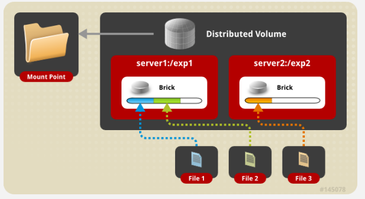

# GlusterFS
클라우드 환경에서 분산되어 있는 서버의 디스크를 묶어  
하나의 분산 파일 시스템으로 만든다면,  
클라우드 구축과 운영에 있어 매우 도움이 될 것이다.

GlusterFS는 Software Defined Storage로,  
Scale-Out한 NAS(Network Attached Storage)파일 시스템이다.

다양한 스토리지 서버를 네트워크(Ethernet, Infiniteband RDMA)를 통해  
하나의 디스크 풀로 묶어 소프트웨어적으로 복제본을 관리하고  
자가 복구 및 스냅샷을 관리할 수 있다.  

이를 통해 클라우드 기반으로  
생성된 vm의 볼륨들을 안정적으로 관리할 수 있게 된다.


GlusterFS는 클라이언트와 서버로 구성되며,  
서버는 Brick 이라는 형태로 볼륨을 제공한다.  

각 서버들은 glusterfsd 데몬을 통해 Brick을 하나의 Volume Pool로 묶고,  
클라이언트는 TCP/IP, InfiniBand 등을 통해 Volume에 마운트할 수 있다.

## GlusterFS 특징
* 파일정보를 각 서버마다 가지고 있음 (metadata server 필요x)
* PB단위로 확장가능 & 다수의 클라이언트 처리가능 (기본NAS는 확장, 처리에 한계가 있음)
* Opensource Software

# GlusterFS Volume Architecture
## Distributed Glusterfs Volume
아무 옵션을 주지 않았을 때 구성되는 기본구조



그림과 같이 각 파일들이 따로따로 Brick에 저장된다.  
File1같은 경우는 server1의 Brick에만 저장되기 때문에  
만약 server1에 장애가 발생한다면 File1은 사용할 수 없는 상태가 된다.

### 목적
* 쉽고 싸게 scale-out이 가능

### 단점
* NO data redundancy
* brick 장애 -> 데이터의 유실을 의미

### 생성 Command
`$ gluster volume create NEW-VOLNAME [transport [tcp | rdma | tcp,rdma]] NEW-BRICK...`

## Replicated Glusterfs Volume
Distributed Volume에서 발생했던 데이터 유실을 막기 위한 구조


File1은 복사되어 server1과 server2 모두에 저장되게 되고,  
만약 server1이 장애가 나더라도 server2에서  
데이터를 가져와서 사용할 수 있다.

복사할 서버가 존재해야하기 때문에, 
최소 2개 이상의 서버가 필요하다.

### 목적
* 데이터의 redundancy와 신뢰성을 높일 수 있음

### 단점
* 서버 총 용량의 1/2밖에 쓰지 못함

### 생성 Command
`$ gluster volume create NEW-VOLNAME [replica COUNT] [transport [tcp |rdma | tcp,rdma]] NEW-BRICK...`

## Striped Glusterfs Volume
데이터를 쪼개서 저장하는 방법


 
File1을 쪼개서 각각 server에 저장합니다. R/W 속도가 빠르다.  
하지만 분산된 데이터 중 하나만 망가져도 전체 데이터를 사용할 수 없다.

### 생성 Command
`$ gluster volume create NEW-VOLNAME [stripe <COUNT>] [transport [tcp |rdma | tcp,rdma]] NEW-BRICK...`

## Dispersed Glusterfs Volume
erasure coding을 기반으로한 저장 방법


Raid 5와 6과 유사하지만 5와 6이 각각 1개와 2개씩밖에  
고장을 허용할수 있는데 반해 disperse는 정하는 만큼 고장을 허용할 수 있다.

### 생성 Command
`$ gluster volume create NEW-VOLNAME [disperse-data COUNT] [redundancy COUNT] [transport tcp | rdma | tcp,rdma] NEW-BRICK...`

Disperse 볼륨을 만드는데 필요한 brick의 개수는  
disperse-data + redundancy로 계산된다.

* disperse-data : redundancy를 제외한 brick  
* redundancy : 몇 개 부셔져도 괜찮은지

redundancy만 명시해주면 자동으로 disperse-data값이 채워진다.  
만약 redundancy가 명시되어있지 않다면 glusterfs의 cofiguration에 의해    
자동 계산되어 들어간다. (warnning 발생)

`$ gluster volume create test-volume redundancy 2 transport tcp server1:/exp1 server2:/exp2 server3:/exp3 server4:/exp3 server5:/exp3 server6:/exp3 server7:/exp3 `


서버는 총 7대고 redundancy는 2니 disperse-data는 5입니다.  
파일조각 아무거나 5조각만 있으면 원본 파일을 복구할 수 있습니다.


# GlusterFS의 설치, 구성

## PrerequisitesPermalink
### Client
* os: CentOS v7.7
* arch: x86_64

### Server1(gfs01)
* os: CentOS v7.7
* arch: x86_64

### Server2(gfs02)
* os: CentOS v7.7
* arch: x86_64


## Before Installation
설치하기 이전에 모든 인스턴스에 hosts파일 설정을 해줍니다.

```
$ vim /etc/hosts

# server의 ip와 hostname
xx.xx.xx.xx gfs01
xx.xx.xx.xx gfs02
```

## Installation (for Server)
glusterfs-server를 설치해준다.

```
$ yum install centos-release-gluster
$ yum install glusterfs-server
```

## 서비스 시작
`$ systemctl start glusterd`

(optional)방화벽 끄기

`$ systemctl stop firewalld`

## Peer 연결
gfs01서버에서 클러스터를 생성해준다.

`$ gluster peer probe gfs02`


클러스터의 상태를 확인합니다.

`$ gluster peer status`


gfs02서버에서 똑같이 상태를 확인해보면  
peer에 gfs01이 뜨는 것을 확인할 수 있다.


## Volume 생성Permalink
각 서버에서(gfs01, gfs02) 볼륨 디렉토리를 생성해준다.  
이 디렉토리들은 brick이 되어, 밑에서 Volume으로 묶어줄 것이다.

`$ mkdir -p /glusterfs/fs`

이제 볼륨을 생성할 건데, 기본 syntax는 다음과 같다.

`$ volume create <NEW-VOLNAME> [stripe <COUNT>] [[replica <COUNT> [arbiter <COUNT>]]|[replica 2 thin-arbiter 1]] [disperse [<COUNT>]] [disperse-data <COUNT>] [redundancy <COUNT>] [transport <tcp|rdma|tcp,rdma>] <NEW-BRICK> <TA-BRICK>... [force]`


이번 테스트에서는 replica 옵션을 사용해서 만들어보겠다

$ gluster volume create vol replica 2 transport tcp gfs01:/glusterfs/fs gfs02:/glusterfs/fs force


## Volume 시작P
생성한 볼륨을 시작시켜줍니다.

`$ gluster volume start vol`

볼륨 정보를 확인해보면 볼륨을 구성하고 있는 brick들의 정보도 확인할 수 있다.

`$ gluster volume info vol`


## Mount Volume to Client
Gluster Volume이 구성되었으니 그 볼륨을 Client에 마운트할 차례다.

glusterfs에서 제공하는 마운트 방법은 NFS, CIFS, Gluster Native(FUSE)가 있다.  
일반적으로 NFS보다 FUSE로 마운트 할 시, 성능이 더 잘나온다고 한다.    
단, 작은 파일에서는 NFS의 캐시 영향을 받아서 성능이 더 좋다고 한다.    
하지만 NFS로 마운트시, 마운트 한 서버가 죽으면 해당 볼륨에 접근할 수 없다.  
반면 FUSE로 마운트하면 마운트 한 서버가 죽어도 나머지 사용가능한 서버에 접근하여 사용할 수 있다.

해당 포스팅에서는 FUSE로 마운트해보겠다.

client에서 FUSE를 설치해줍니다.

```
$ yum install centos-release-gluster
$ yum install glusterfs glusterfs-fuse
```

마운트 하기 위한 적당한 폴더를 만들어준다.

`$ mkdir /root/test`

마운트 :

```
# mount -t {mount-type} {server ip}:{volume name} {local mount point}
# gfs01또는 02로
$ mount -t glusterfs gfs01:vol /root/test
```

그다음 디스크를 확인해보면 :

`$ df /root/test`


제대로 마운트 된 것을 확인해보실 수 있다.

파일을 생성하고, gfs01과 gfs02서버의 brick에가서 보면 똑같은 파일이 생성된 것을 확인할 수 있다


# 참고자료
[gruuuuu.github.io](https://gruuuuu.github.io/linux/glusterfs/)
